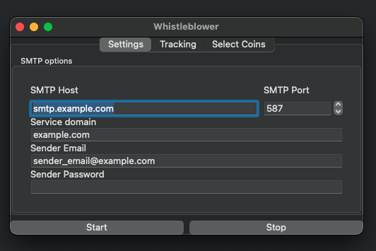
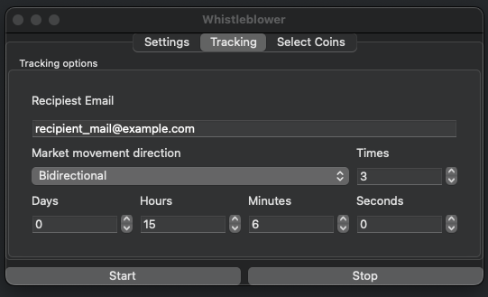
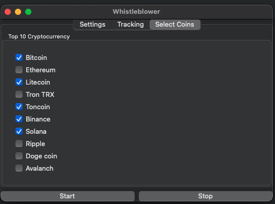

# **whistleblower**

## *An app that describes a primitive trading strategy, and helps you not to oversleep*

## Screenshots






## Run Locally

Require version of ruby <= 3.0.0
```bash
  ruby -v
```
Clone repo

```bash
  git clone https://link-to-project
```

Go to cloned directory

```bash
  cd whistleblower
```

Install dependencies

```bash
  bundle install
```

Make main.rb executable 

```bash
  chmod +x ./main.rb
```

Or just 

```bash
  ruby --jit main.rb
```

